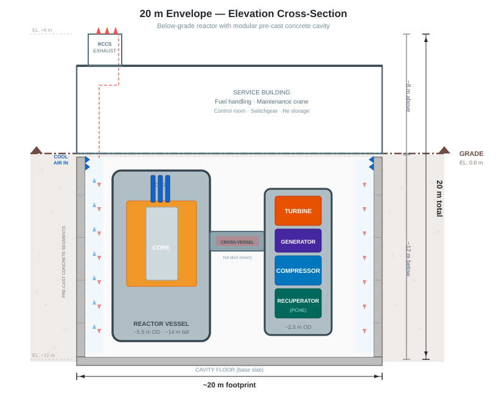

# 01 · Design Overview

## Mission

Deliver **grid-connected AC electricity** from a self-contained, factory-built nuclear power unit no larger than **20 m × 20 m × 20 m**. The entire reactor and power conversion system ships as a unit with minimal site preparation.

**Secondary capability:** carbon-free hydrogen production via high-temperature electrolysis, using generator output when hydrogen demand exists. The nuclear island is identical in both modes.

## Top-Level Requirements

| Parameter | Target | Rationale |
|---|---|---|
| Primary output | AC electricity to grid | Core mission |
| Physical envelope | 20 m × 20 m × 20 m | Factory-fabricable, shippable as a unit |
| Thermal power | ~100–150 MW(th) | Sized to fit envelope; see §03 |
| Net electrical output | ~50–70 MW(e) | ~47% cycle efficiency × thermal power |
| Core outlet temperature | ≥ 950 °C | Enables ~47–50% Brayton efficiency |
| Core inlet temperature | ~580 °C | Recuperator cold outlet; from §05 Brayton cycle analysis |
| Coolant | Helium | Chemically inert, single-phase, direct Brayton working fluid |
| Moderator | Nuclear-grade graphite | Excellent high-T properties, neutron economy |
| Fuel form | TRISO particles in graphite matrix | Coated-particle safety, high burnup tolerance |
| Core geometry | Annular prismatic block | Passive safety, uniform outlet T, simple operation |
| Power conversion | Direct Brayton — helium drives turbine | No IHX, no secondary loop |
| Primary pressure | 4 MPa | Thinner vessel walls, lower stored energy, reduced tritium permeation vs. 7 MPa |
| Graphite specification | Low-lithium nuclear grade (Li < 0.1 ppm) | Reduces tritium generation at source |
| Fuel enrichment | < 5% ²³⁵U (LEU) | Proliferation resistance; standard supply chain |
| Target discharge burnup | 80–100 GWd/tHM | Maximise energy extracted per fuel load |
| Refueling interval | 12 months | Annual site visit; spent fuel removed each visit |
| Precooler | Air-cooled | No water supply dependency; works anywhere |
| RCCS | Air-cooled, passive natural convection | No water; works anywhere; below-grade preferred |
| Passive decay heat removal | Yes — no active systems required | Walk-away safety |

## Key Design Philosophy

1. **Simplicity above all.** Fewer components means fewer failure modes, easier maintenance, and lower cost. Every added component must justify itself.

2. **Solve hard problems with better materials, manufacturing, and geometry — not more components.** When a constraint seems to demand a new system, the preferred answer is a material, process, or optimised geometry that makes the system unnecessary. The CMC turbine blade is the template: rather than adding blade cooling infrastructure, use a material that doesn't need it. Coolant channel geometry is the next application: rather than raising primary pressure to improve heat transfer, optimise the channel shape computationally and validate physically.

3. **Use computational optimisation to find geometries that intuition cannot.** Stellarator fusion devices find coil geometries using adjoint-based shape optimisation that outperform anything a human designer would produce. The same approach applies to coolant channel geometry in the fuel blocks — optimise the shape against conjugate heat transfer physics, prototype in graphite, validate with air-flow testing, iterate. Manufacture what the physics demands.

4. **Sweat the fuel.** Extract maximum energy from every fuel load. Multi-batch fuel management and high target burnup minimise fuel throughput, reduce spent fuel volume, and reduce cost per kWh. The TRISO form is itself a robust waste form — the design should exploit this.

5. **Fuel as the first barrier.** TRISO coatings retain fission products up to ~1600 °C, well above any credible accident temperature. The reactor is designed so that peak fuel temperature *never* approaches this limit.

6. **Graphite as a thermal flywheel.** The large graphite heat capacity and negative temperature coefficient provide inherent self-regulation.

7. **Helium does one job.** The same helium that cools the core drives the turbine directly. No intermediate heat exchanger, no secondary loop, no steam generators.

8. **Helium purity is safety-critical.** Moisture and CO₂ attack graphite at high temperature; the helium purification system is a first-class design concern.

9. **Modularity.** The 20 m envelope is a hard constraint, not an aspiration. A site can host multiple units; scale by replication, not by building bigger reactors.

## Physical Layout Concept

The 20 m × 20 m × 20 m envelope spans **below and above grade**. Approximately 10–12 m is below grade (reactor vessel, lower turbomachine, cross-vessel); 8–10 m is above grade (upper turbomachine, building, RCCS exhaust stack). The full 20 m vertical dimension acts as the RCCS chimney height.



The below-grade depth is not wasted envelope — it contributes chimney height to the air RCCS, seismic isolation, radiation shielding mass, and physical security. The above-grade surface expression is a compact industrial building. See [§11 · Siting](11-siting.md) for full civil layout.

## Open Design Decisions

- [x] **Core geometry: annular prismatic block**
- [x] **Power conversion: direct Brayton cycle** — helium from core drives turbine directly; no IHX
- [x] **Fuel enrichment: LEU (< 5% ²³⁵U)** — proliferation resistance non-negotiable
- [x] **Turbine rotor: full ceramic blisk** — SiC/SiC CMC, additive manufacturing target; blades and disk co-manufactured, no attachment joints
- [x] **Physical envelope: 20 m × 20 m × 20 m**
- [ ] Thermal power rating: optimise for engineering margins within envelope — scaling is a later concern
- [x] **Hydrogen: HTE (SOEC) as electrical secondary** — reactor unchanged; electrolyzer modules consume generator output; S–I rejected (requires IHX, contradicts simplicity)
- [x] **Precooler: air-cooled** — no water supply dependency; unit works anywhere
- [x] **Refueling interval: 12 months** — annual site visit; fresh fuel in, spent fuel out; limits on-site spent fuel inventory
- [x] **Below-grade installation** — reactor vessel sited ~10–12 m below grade; 20 m envelope spans total depth + above-grade height

## Relationship to Prior Designs

```
HTTR (Japan, prismatic, 950 °C demonstrated)
  └── Outlet temperature feasibility; helium purification requirements

GT-MHR (General Atomics)
  └── Annular prismatic core; direct Brayton cycle; side-by-side vessel layout

Xe-100 (X-energy)
  └── Modern SMR safety case; regulatory approach for prismatic HTGR

NGNP (US DOE)
  └── High-burnup TRISO performance data; multi-batch fuel management studies
```

---

*Next: [02 · Fuel Design](02-fuel.md)*
