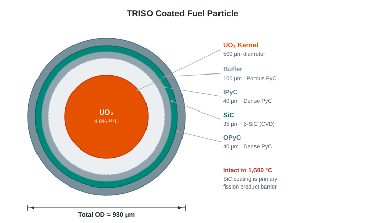

# 02 · Fuel Design

## The TRISO Particle

TRISO (TRi-structural ISOtropic) is a coated fuel particle: a uranium oxide kernel surrounded by four concentric coating layers, each with a distinct function. The complete particle is ~0.93 mm in diameter — smaller than a grain of rice.



### Recommended Dimensions

| Layer | Material | Thickness | Cumulative OD |
|---|---|---|---|
| Kernel | UO₂ | 500 μm diameter | 500 μm |
| Buffer | Porous PyC | 100 μm | 700 μm |
| IPyC | Dense PyC | 40 μm | 780 μm |
| SiC | β-SiC (CVD) | 35 μm | 850 μm |
| OPyC | Dense PyC | 40 μm | 930 μm |

**Kernel diameter: 500 μm.** Larger than the 425 μm kernel used in HALEU designs, specifically to compensate for the lower enrichment of LEU. A larger kernel provides more uranium and more U-235 per particle at the same enrichment. This is the correct direction of adjustment for LEU fuel.

**Enrichment: 4.8% ²³⁵U.** Approaching the 5% LEU limit to maximise fissile loading while maintaining the non-proliferation constraint. This is a deliberate choice — every fraction of a percent of enrichment below the limit is useful fissile material left on the table.

**Buffer layer: 100 μm.** Slightly thicker than some heritage designs to accommodate the increased fission gas production from the larger kernel over the target burnup of 80–100 GWd/tHM. The buffer absorbs fission gases (Kr, Xe) released from the kernel and accommodates kernel swelling without stressing the SiC layer.

**SiC layer: 35 μm of β-SiC deposited by CVD.** This is the same material as the turbine blisk — SiC is a consistent material choice across the design, from fuel particle pressure vessel to power conversion rotor. The material knowledge base built for one application directly informs the other.

### Why TRISO Works at These Conditions

At 80–100 GWd/tHM and peak fuel temperatures well below 1600 °C (the design maintains substantial margin):
- SiC layer retains structural integrity and contains fission products
- Fission gas pressure in the buffer remains within SiC pressure vessel limits
- PyC layers remain well-bonded

The US NRC-qualified TRISO programme (BWXT) has demonstrated coating integrity to ~170 GWd/tHM in irradiation tests — our target burnup has significant margin below this demonstrated limit.

## Fuel Compact

TRISO particles are embedded in a **cylindrical graphite matrix compact**. The compact is the unit that sits within the fuel block.

### Recommended Compact Dimensions

| Parameter | Value | Notes |
|---|---|---|
| Diameter | 12.5 mm | GT-MHR heritage; compatible with standard handling |
| Length | 49 mm | GT-MHR heritage; ~3.9:1 aspect ratio |
| TRISO packing fraction | 35% by volume | Well within fabrication limits; ~40% is practical max |
| Matrix material | Nuclear-grade graphite | IG-110 equivalent; same low-Li spec as moderator |

At 35% packing fraction with 500 μm kernels at 4.8% enrichment:
- ~11,000 TRISO particles per compact
- U-235 per compact: ~0.22 g
- U (total) per compact: ~4.6 g

### Fissile Loading Estimate

These numbers feed into the neutronics calculation (§04) which will confirm whether the loading achieves criticality and the target cycle length. They represent a starting point consistent with heritage designs scaled for our specific enrichment and kernel size.

## Fuel Block: Two-Generation Design

The fuel compact sits within the graphite fuel block. This is where the TPMS design philosophy applies — and where a clear two-generation development path is defined.

### Generation 1: TPMS Coolant Channels, Conventional Compact Seats

The **Gen 1 block** retains discrete cylindrical fuel compact seats machined or formed into the graphite, but the coolant path between and around the compact columns uses **gyroid TPMS geometry** rather than circular drilled holes.

```
  Top view, Gen 1 block (schematic):

  ┌──────────────────────────────────┐
  │  ●   ●   ●   ●   ●   ●   ●      │
  │    ∿∿∿∿∿∿∿∿∿∿∿∿∿∿∿∿∿∿∿∿∿∿∿    │
  │  ●   ●   ●   ●   ●   ●   ●      │
  │    ∿∿∿∿∿∿∿∿∿∿∿∿∿∿∿∿∿∿∿∿∿∿∿    │
  │  ●   ●   ●   ●   ●   ●   ●      │
  └──────────────────────────────────┘
  ● = fuel compact (cylindrical, conventional)
  ∿ = gyroid TPMS coolant channels (optimised geometry)
```

The compact positions provide geometric regularity for neutronics (uniform moderation ratio across the block). The TPMS coolant geometry provides optimised heat transfer between compact surfaces and the helium. The two geometries are independently optimised and then co-located.

**Manufacturing route:** Additive graphite block (binder jetting of IG-110 grade powder, sintered) with the TPMS coolant void and compact seat geometry defined in the print. Compact insertion at fuel fabrication.

This is manufacturable with advancing but near-term additive graphite capability. It captures most of the heat transfer benefit of TPMS while using a proven fuel compact form.

### Generation 2: Distributed TRISO in TPMS Solid Domain

The **Gen 2 block** removes the distinction between "fuel compact" and "moderator graphite" entirely. TRISO particles are distributed uniformly throughout the solid domain of the TPMS structure. The solid domain is the fuel-bearing material; the void domain is the helium coolant path.

```
  Gen 2 concept:

  Solid domain (TPMS):  graphite matrix with TRISO particles
                        distributed uniformly throughout
                        at 35% packing fraction

  Void domain (TPMS):   helium coolant — continuously connected,
                        maximally in contact with fuel-bearing solid
```

Every surface of the TPMS structure is simultaneously:
- A heat transfer surface (fuel to coolant)
- A moderating surface (thermalising neutrons from the fuel)
- A structural surface (carrying the block loads)

Peak fuel temperature in Gen 2 is lower than Gen 1 for the same thermal power, because the maximum distance from any fuel particle to the nearest coolant surface is set by the TPMS unit cell size (~10–15 mm), not by the compact diameter (12.5 mm) plus the graphite land between compact and coolant channel.

**Manufacturing route:** Requires infiltration of a pre-formed TPMS graphite skeleton with TRISO-bearing graphite matrix slurry, followed by sintering. An alternative is to print the TPMS structure using a TRISO-doped graphite feedstock — a significant additive manufacturing challenge but physically feasible. This route awaits qualification of the fabrication process.

**Gen 2 is the design target.** Gen 1 is the route to it.

## Fission Product Retention

Under normal operating conditions (peak fuel temperature ~1,140–1,240 °C depending on core outlet temperature — well below the 1,600 °C limit), TRISO coatings retain essentially all fission products within the particle. The SiC layer is the primary barrier for metallic fission products (Cs, Sr, Ag); the PyC layers contain fission gases.

The design margin — ~1,240 °C peak fuel temperature (at 950 °C outlet) vs. 1,600 °C failure threshold — gives 360 °C of headroom; at the FOAK 850 °C outlet the margin is 460 °C. This is the margin that justifies the walk-away safety case: even in a depressurised loss-of-forced-cooling accident, the graphite thermal mass and RCCS ensure peak temperatures never approach the failure threshold (§07).

## Fabrication

TRISO particles are produced by fluidised-bed chemical vapour deposition (FBCVD):
1. UO₂ kernels formed by sol-gel or freeze-drying
2. Successive PyC and SiC layer deposition in a fluidised bed reactor
3. Quality control: X-ray, optical inspection of coating uniformity; pressure testing of statistical sample

Gen 1 compacts: TRISO particles overcoated with graphite matrix powder, pressed into cylindrical compacts, carbonised.

Gen 2 blocks: development ongoing — slurry infiltration or doped-feedstock printing routes under investigation.

Qualified TRISO fabricators: BWXT (USA), INET/Tsinghua (China), NFI (Japan). The kernel and coating process is not classified or proliferation-sensitive.

## Open Questions

- [ ] Confirm fissile loading per block and total core inventory → neutronics (§04)
- [ ] Confirm peak fuel temperature at 4 MPa with TPMS coolant geometry → thermal-hydraulics (§05)
- [ ] Optimal TPMS unit cell size: minimum wall thickness must accommodate ≥ 3 particle diameters (~3 mm) while maximising surface area density
- [ ] Gen 2 fabrication route: slurry infiltration vs. doped-feedstock printing — development programme needed

---

*Previous: [01 · Overview](01-overview.md) | Next: [03 · Core Design](03-core.md)*
