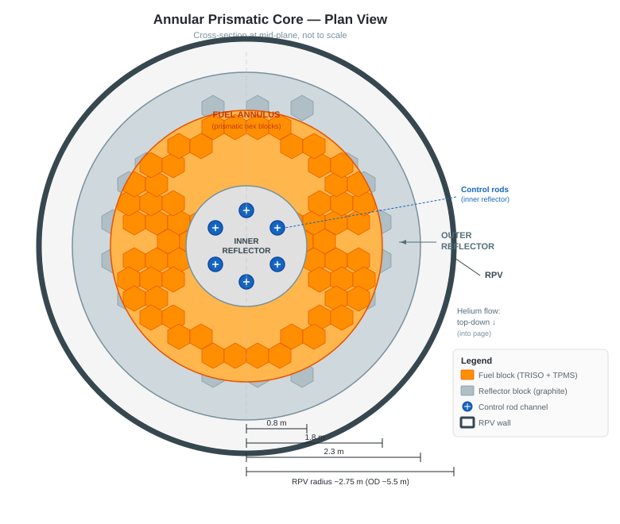

# 03 · Core Design

## Geometry: Annular Prismatic

The core is an **annular arrangement of hexagonal graphite fuel block columns**, with a solid inner reflector at the centre and a solid outer reflector at the periphery. The fuel lives in the annular region between them.



The annular geometry is the key passive safety enabler: decay heat conducted outward through the outer reflector to the reactor cavity cooling system (RCCS) is sufficient to keep peak fuel temperature below the TRISO failure limit with no active systems. A solid-core design at the same power level cannot guarantee this.

## Fuel Block Design

Each fuel block is a **hexagonal graphite prism**, approximately 793 mm tall and 360 mm across flats — dimensions close to the GT-MHR standard, which have good operational heritage.

Each block contains two types of axial channels drilled through it:

- **Fuel channels:** larger-diameter holes containing cylindrical TRISO fuel compacts stacked end-to-end
- **Coolant channels:** smaller-diameter holes through which helium flows from top to bottom

The ratio of fuel channels to coolant channels per block, and their diameters, sets the local power density, peak fuel temperature, and coolant outlet temperature. This geometry is fixed at manufacture.

### Channel Geometry Optimisation

Traditional prismatic blocks use circular drilled holes — a manufacturing constraint, not a physics requirement. The coolant channel profile is a pure drilling artifact. This design treats channel geometry as a free variable to be optimised, then asks what manufacturing process can realise the optimum.

**The objective:** minimise peak fuel temperature (and therefore maximise margin to the 1600 °C TRISO limit) for a given thermal power and pumping power budget. This is a conjugate heat transfer optimisation — the solid graphite temperature field and the helium flow field are coupled and must be optimised together.

**The precedent: stellarator coil optimisation**

Stellarator fusion devices face a structurally identical problem: find a 3D geometry such that the resulting physics field (magnetic, in their case) achieves desired confinement properties. The relationship between coil shape and field behaviour is too complex for intuition — the answer is computational optimisation using adjoint methods and iterative shape search. Wendelstein 7-X found coil geometries no human designer would have produced, and they outperform intuitive designs significantly.

The same mathematical machinery applies here. The relationship between channel cross-section, axial profile, and local heat transfer coefficient distribution is non-intuitive. Adjoint-based CFD shape optimisation can search this space systematically, finding geometries that are better than anything derivable by hand.

**Selected direction: TPMS-informed channel geometry**

**Triply Periodic Minimal Surfaces (TPMS)** are the target geometry class for the coolant channels. TPMS are mathematically defined surfaces — zero mean curvature everywhere, repeating periodically in all three spatial directions — that partition space into two interpenetrating, continuously connected domains. In a fuel block context, one domain carries the helium coolant and the other is the graphite/fuel solid.

Key properties that make TPMS compelling here:

| Property | Significance |
|---|---|
| Maximum surface area per unit volume | Highest possible heat transfer area in a given block volume |
| Smooth, continuous surfaces | No sharp corners, no flow separation, low pressure drop for a given heat transfer rate |
| Mathematically defined | Exactly reproducible; parameterisable for computational optimisation |
| Additive-manufacture-native | Cannot be drilled or conventionally machined; requires additive fabrication — which we already need for this design |

The **gyroid** is the leading candidate TPMS geometry. It has no self-intersections, excellent flow connectivity, and has been demonstrated in metal additive manufacturing for compact heat exchangers with performance exceeding conventional designs by 30–50% in surface area density.

```
  Conventional prismatic block:     TPMS gyroid block:

  ○ ○ ○ ○ ○ ○ ○                    ╔═══════════════╗
  ○ ● ○ ● ○ ● ○                    ║  ∿∿∿∿∿∿∿∿∿∿∿ ║
  ○ ○ ○ ○ ○ ○ ○   →                ║ ∿∿∿∿∿∿∿∿∿∿∿∿ ║
  ○ ● ○ ● ○ ● ○                    ║  ∿∿∿∿∿∿∿∿∿∿∿ ║
  ○ ○ ○ ○ ○ ○ ○                    ╚═══════════════╝
  (● fuel, ○ coolant/graphite)      (interpenetrating domains)
```

The TPMS geometry is not a single fixed shape — it has tunable parameters (unit cell size, surface offset, wall thickness) that can be adjusted to vary the solid-to-void fraction and the characteristic length scale. This is the handle for computational optimisation: the TPMS parameters are varied, the conjugate heat transfer performance is evaluated, and the optimum is found for the specific conditions at each axial position in the core.

**Axially graded TPMS** — varying the unit cell parameters along the fuel block height — allows the geometry to follow the axial neutron flux profile. Where flux is high (core mid-plane), denser surface structure; where flux is low (top and bottom), coarser structure. Every element of the geometry earns its place.

**Manufacturing route:** Additive graphite fabrication — specifically binder jetting of nuclear-grade graphite powder followed by densification sintering. Several industrial suppliers (Schunk Carbon, Toyo Tanso) are developing additive graphite processes. TPMS graphite blocks represent a significant but technically credible step beyond current capability, on a clear development trajectory.

**What conventional optimisation still covers:**

- **Axially varying cross-section** — a simpler but manufacturable-today approach for early prototypes before full TPMS fabrication is qualified
- **Integrated fuel compact seating** — co-manufactured tight-tolerance seats that locate fuel compacts precisely, improving thermal contact regardless of the surrounding channel geometry

**The optimisation loop:**

```
  1. Parametric or topology-based geometry definition
           │
           ▼
  2. Conjugate CFD simulation (helium flow + graphite heat conduction)
           │
           ▼
  3. Neutronics coupling (channel geometry affects local moderation ratio)
           │
           ▼
  4. Objective evaluation (peak fuel T, pressure drop, power peaking factor)
           │
           ▼
  5. Shape update (adjoint gradient or gradient-free: genetic algorithm, Bayesian)
           │
           └──── iterate until convergence ────┘
```

**Physical testing with air:**

Before committing a geometry to helium service, it is validated experimentally using air. This is standard HTGR practice and is physically justified: helium and air have similar Prandtl numbers (~0.66 vs ~0.71), so heat transfer correlations from air experiments scale directly to helium service via the Reynolds and Nusselt number similarity. Air is cheap, safe to handle at scale, and allows high-iteration physical testing at a fraction of the cost of helium testing.

The sequence: optimise computationally → prototype channel geometry in test graphite blocks → validate heat transfer and pressure drop in an air flow rig → refine → iterate. The air rig is a low-cost, high-throughput development tool.

**At 4 MPa, this optimisation matters more**

The decision to run at 4 MPa rather than 7 MPa reduces helium density by ~43%. For the same thermal power, the channels must work harder per unit of driving pressure. An optimised channel geometry compensates for the lower density by improving the heat transfer coefficient — achieving equivalent or better thermal performance with a physically simpler (lower pressure) primary circuit. The optimisation is not just desirable; it is part of how the 4 MPa design closes.

The principle: use manufacturing capability and computational optimisation to do what higher pressure would otherwise do. Better geometry replaces a more demanding engineering specification.

## Reflector Design

### Inner Reflector

Solid graphite column at the core centre. Houses **control rod channels** — the inner reflector is the primary control rod location. This keeps control rods out of the fuel annulus, avoiding local flux depression in the fuel region and simplifying fuel block geometry.

### Outer Reflector

Solid graphite annulus surrounding the fuel. Functions as:

- Neutron reflector (reflects fast neutrons back into the fuel region, improving neutron economy)
- Thermal flywheel for decay heat conduction
- Structural support for fuel columns
- Mounting location for **reserve shutdown channels** (see below)

### Top and Bottom Reflectors

Graphite blocks above and below the active fuel region. The top reflector assembly includes penetrations for control rod drives and helium inlet. The bottom reflector is the helium outlet plenum.

## Control and Shutdown

### Control Rods

Located in the inner reflector. Boron carbide (B₄C) absorber sections on graphite or SiC composite spine assemblies. Inserted from the top by motor drives; gravity-assisted insertion on scram.

Having control rods entirely in the inner reflector (not in the fuel annulus) is operationally cleaner — no fuel blocks need to be designed around control rod channels.

### Reserve Shutdown System

A passive backup to control rods: small boron carbide spheres (absorber balls) stored above the core that flow by gravity into dedicated channels in the outer reflector on demand. No mechanical actuation required beyond opening a valve. This is a demonstrated feature of the HTTR design.

Two diverse, passive shutdown mechanisms with no shared failure modes. No active pumps or power required for either.

## Fuel Loading and Enrichment

With LEU (< 5% ²³⁵U), a single enrichment level across the core is the simplest starting point. Enrichment zoning — higher enrichment at the top and bottom of the fuel columns where flux is lower — can extend cycle length and flatten the axial power profile, but adds fuel fabrication complexity.

**Starting assumption:** uniform enrichment, accept the axial peaking factor, optimise later if the cycle length target demands it.

## Core Dimensions and the 20 m Envelope

Core dimensions are driven by two constraints working together:

1. **Passive safety** sets the fuel annulus thickness at ~1 m, independent of power. This ensures decay heat can conduct to the outer vessel wall and radiate to the RCCS without active cooling.
2. **The 20 m × 20 m × 20 m physical envelope** sets the maximum reactor vessel size, which in turn caps thermal power.

### Sizing Estimate

Assumed geometry:
- Inner reflector radius: 0.8 m
- Fuel annulus: 1.0 m → outer fuel radius: 1.8 m
- Outer reflector: 0.5 m → outer core radius: 2.3 m → core diameter: 4.6 m
- Reactor vessel outer diameter: ~5.5 m (vessel wall + insulation)
- Vessel total height: active height + ~8 m (top/bottom reflectors, plenums, control rod drives above)

Fuel annulus cross-sectional area:
π × (1.8² − 0.8²) = π × 2.6 ≈ **8.2 m²**

At a conservative power density of 4 MW(th)/m³:

| Thermal power | Active height | Total vessel height |
|---|---|---|
| 100 MW(th) | 3.0 m | ~11 m |
| 125 MW(th) | 3.8 m | ~12 m |
| 150 MW(th) | 4.6 m | ~13 m |

All three fit within the 20 m height envelope, with room for the cross-vessel connection to the turbomachine at the top. The turbomachine vessel (vertical, ~2.5 m dia, ~6 m tall) sits alongside within the 20 m footprint.

**Working assumption: 100–150 MW(th)**, to be fixed once a full sizing study is done. At ~43–47% cycle efficiency (depending on turbine inlet temperature; see §08 phased strategy) this delivers **~43–70 MW(e)** net to the grid.

## Open Questions

- [ ] Thermal power: 100 MW(th) vs 150 MW(th) — detailed envelope study needed
- [ ] Fuel block channel geometry: circular baseline vs. optimised profiles — manufacturing readiness decision
- [ ] Control rod count and worth distribution in inner reflector
- [ ] Enrichment zoning: uniform first, revisit if cycle length target requires it
- [ ] Number of fuel columns in the annulus (set by final core diameter)

---

*Previous: [02 · Fuel](02-fuel.md) | Next: [04 · Neutronics](04-neutronics.md)*
