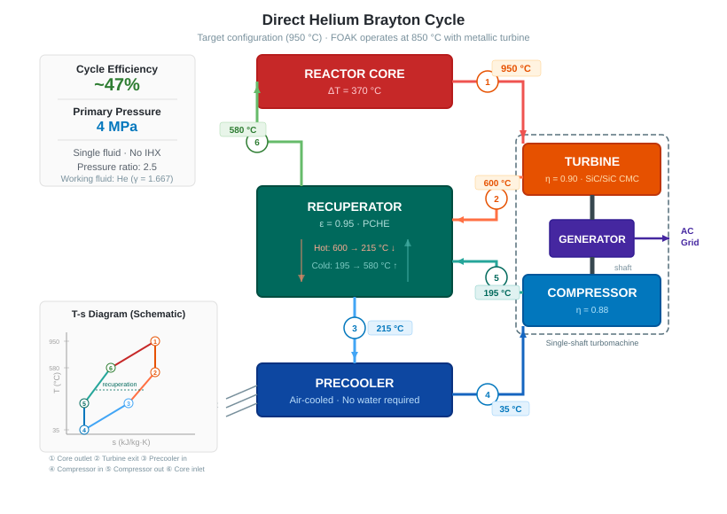

# 08 · Power Conversion

## Architecture: Direct Brayton Cycle

The same helium that cools the reactor core flows directly through the turbomachine. There is no intermediate heat exchanger and no secondary working fluid. This is the defining simplicity decision of the design.



The recuperator is essential: it transfers heat from the turbine exhaust back into the helium stream returning to the core, dramatically improving cycle efficiency without adding a second fluid.

## Key Cycle Parameters (Preliminary)

| Parameter | FOAK | Target | Notes |
|---|---|---|---|
| Turbine inlet temperature | 850 °C | 950 °C | Matches core outlet; see phased strategy below |
| Compressor inlet temperature | 35 °C | 35 °C | After air-cooled precooler |
| Primary pressure (high side) | 4 MPa | 4 MPa | |
| Pressure ratio | ~2.5 | ~2.5 | Optimal for He at this temperature ratio |
| Recuperator effectiveness | ~95% | ~95% | Target |
| Net cycle efficiency | ~43% | ~47% | vs. ~33% for LWR steam Rankine |
| Working fluid | He | He | γ = 1.667, Cp = 5.19 kJ/kg·K |

Helium's high γ (1.667 vs 1.4 for air) makes it thermodynamically favorable for Brayton cycles. A pressure ratio of only ~2.5 achieves efficiencies that would require much higher ratios in air or CO₂.

*The cycle schematic above shows the target (950 °C) configuration. The 850 °C FOAK variant uses identical components with a lower core outlet temperature; see temperature chain comparison in §05.*

## Phased Turbine Strategy

The turbine is the only component that changes between FOAK and target configurations. The nuclear island — core, fuel, graphite, vessel, RCCS, confinement building — is identical at both temperatures. The core is capable of 950 °C outlet from day one; the FOAK variant simply does not exploit the full temperature capability.

### FOAK: Metallic Turbine at 850 °C

The first units use a **conventional nickel superalloy turbine** (IN-738 or CM-247) operating at 850 °C inlet. At this temperature, Ni superalloys are well within their proven operating envelope — no film cooling, no thermal barrier coatings, no novel materials. The turbomachine is a known quantity with an established supply chain.

| Parameter | 850 °C FOAK | 950 °C Target |
|---|---|---|
| Turbine material | Ni superalloy (IN-738 / CM-247) | SiC/SiC CMC blisk |
| Turbine inlet temperature | 850 °C | 950 °C |
| Net cycle efficiency | ~43% | ~47% |
| Electrical output (100 MW(th)) | ~43 MWe | ~47 MWe |
| Electrical output (150 MW(th)) | ~65 MWe | ~70 MWe |
| Recuperator material | 316H stainless steel | Alloy 617 or equivalent |
| Peak fuel temperature | ~1,140 °C | ~1,240 °C |
| Margin to TRISO limit | ~460 °C | ~360 °C |

The 850 °C variant delivers ~8% less electrical output at the same thermal power. In exchange:

- **Zero turbine development risk** — off-the-shelf gas turbine technology
- **Lower recuperator cost** — 316H stainless steel at ~540 °C hot-side temperature vs. Alloy 617 at ~600 °C
- **Larger safety margin** — ~460 °C to the TRISO 1,600 °C limit instead of ~360 °C
- **Faster time to market** — no ceramic blisk development dependency

The value of the FOAK metallic turbine is not lower LCOE — the reduced output slightly increases cost per MWh. The value is **de-risking**: getting the first unit built, proving the nuclear island works, and generating operational data while the ceramic blisk matures.

### Target: Ceramic Blisk at 950 °C

Once the SiC/SiC CMC blisk is industrialised (see manufacturing trajectory below), subsequent units upgrade to 950 °C operation. The upgrade is a **turbomachine swap** — the reactor vessel is never opened. The nuclear island, fuel qualification, safety case, and operating licence are unaffected.

This phased approach means the ceramic blisk is not on the critical path for first deployment. It becomes an efficiency upgrade applied to later units as the supply chain matures.

## Turbomachine Design

### Single-Shaft Layout

All rotating components — turbine, compressor, and generator — sit on a single vertical shaft. This eliminates gearboxes and shaft couplings, consistent with the simplicity goal. The GT-MHR program validated this configuration at the design level.

```
   ┌─────────────┐
   │   TURBINE   │  ← hot end, top
   ├─────────────┤
   │  GENERATOR  │
   ├─────────────┤
   │  COMPRESSOR │  ← cold end, bottom
   └─────────────┘
```

Magnetic bearings are preferred over oil-lubricated bearings to avoid helium contamination.

### Shaft Speed

Helium's low molecular weight (4 g/mol) means low enthalpy drop per turbine stage. To achieve the required pressure ratio without an impractical number of stages, the shaft runs at high speed — likely 3,000–6,000 RPM for this power class. A frequency converter decouples shaft speed from grid frequency (50/60 Hz), avoiding a gearbox.

### Number of Stages

Preliminary estimate: 4–6 turbine stages and 4–6 compressor stages. Exact count depends on final pressure ratio and allowable tip speed, which are set by blade material limits.

## Turbine Blade Materials

### Why Nickel Superalloys Work at 850 °C but Not 950 °C

At 850 °C turbine inlet, blade metal temperatures of ~820–840 °C are within the proven envelope of high-performance Ni superalloys (IN-738, CM-247). Creep life is adequate, no film cooling is required, and helium's inert chemistry eliminates hot corrosion. This is why the FOAK variant uses a metallic turbine.

At 950 °C, blade metal temperatures approach 900–930 °C. Nickel superalloys are at their absolute limit here, and the standard mitigation — internal film cooling — is not available because the working fluid *is* helium. There is no separate cooling stream to bleed through blade passages. Creep life at sustained 930 °C with no cooling margin is the fundamental objection to Ni alloys at the target temperature.

### Selected Material: SiC/SiC Ceramic Matrix Composite (CMC)

SiC fibres in a SiC matrix, typically manufactured by chemical vapour infiltration (CVI) of the SiC matrix around woven SiC fibre preforms.

**Why CMC is a stronger choice here than in air-breathing turbines:**

In jet engines, SiC/SiC faces a serious degradation mechanism: water vapour in the combustion gas reacts with SiO₂ (the native oxide on SiC surfaces) to form volatile Si(OH)₄, causing progressive material recession. Environmental barrier coatings (EBCs) are required to protect CMC hardware in aircraft engines.

In pure helium, this mechanism does not exist. There is no water vapour, no oxygen, no sulfur. The degradation modes that make CMC challenging in air — oxidation, hot corrosion, EBC spallation — are simply absent. The material can operate at its intrinsic temperature and creep limits without protective coatings.

**Relevant properties of SiC/SiC:**

| Property | SiC/SiC CMC | Ni superalloy (CMSX-4) |
|---|---|---|
| Max service temperature | ~1350 °C | ~950 °C (uncooled) |
| Density | ~2.7 g/cm³ | ~8.9 g/cm³ |
| Creep rate at 950 °C | Negligible | Significant — limiting factor |
| Oxidation in He | None | None |
| Fracture toughness | ~15–25 MPa√m | ~80+ MPa√m |

The density advantage is significant: CMC blades are ~70% lighter than equivalent Ni blades, reducing centrifugal stress on the rotor disk and enabling higher tip speeds if needed.

**The TRISO connection:**

SiC is already the pressure-retaining fission product barrier in TRISO fuel particles. This design uses the same material class as both the fuel's pressure vessel and the turbine blades. The high-temperature nuclear behaviour of SiC is therefore already central to the design's safety case, and the material knowledge base applies across both applications.

### Rotor Architecture: Full Ceramic Blisk

The blade root attachment problem is eliminated entirely by co-manufacturing blades and disk as a single integrated ceramic component — a **blisk** (bladed disk). There are no attachment interfaces, no stress concentration at a root joint, no differential thermal expansion between blade and disk material.

This is the correct application of the design principle: solve the problem with manufacturing, not with a mechanical solution that adds complexity.

```
  Traditional:  [blade] ──fir-tree root──► [disk]   ← two parts, joint is the failure mode
  Blisk:        [blade + disk]                       ← one part, no joint
```

**Mechanical advantage of an all-ceramic blisk:**

The low density of SiC (~2.7 g/cm³ vs ~8.9 for Ni superalloy) means centrifugal stress on the rotor at a given tip speed is approximately 3× lower than an equivalent metal blisk. This creates design margin that can be used in two ways:
- Accept the same tip speed with greatly reduced stress → longer fatigue life
- Run at higher tip speed → fewer stages required for the same pressure ratio

A smaller stage count simplifies the turbomachine and reduces its axial length — consistent with fitting inside the 20 m envelope.

**Shaft interface:**

The ceramic blisk attaches to a metallic shaft. This ceramic-to-metal interface is the one remaining mechanical joint that requires careful design: SiC has a coefficient of thermal expansion (CTE) of ~4 × 10⁻⁶ /°C, while typical shaft steels are ~11–13 × 10⁻⁶ /°C. The joint design must accommodate this differential without generating damaging stresses on heat-up and cool-down. Options include a metallic hub insert with controlled interference fit, or a compliant coupling layer. This is a well-understood problem in ceramic engineering — it does not require novel solutions.

**Containment:**

A ceramic blade liberation event produces different fragment characteristics than a metal blade liberation. The containment ring surrounding the turbine stage must be designed for ceramic fragment ballistics — typically higher velocity, smaller fragments than metal. This drives the containment casing design but is not a fundamental barrier.

### Manufacturing Trajectory: Additive Ceramics

The blisk geometry — complex 3D airfoil surfaces, internal structure, precise dimensional tolerances — is ideally suited to additive manufacturing rather than traditional subtractive processes.

**Current capability (2025):**
- High-resolution ceramic stereolithography (SLA/DLP): systems such as Lithoz CeraFab produce dense, complex alumina and zirconia parts at sub-100 µm resolution. SiC variants are in active development.
- Binder jetting of SiC: near-net-shape parts, post-process sintering. Suitable for complex geometry; surface finish and density improving rapidly.
- Both routes produce **monolithic SiC** or **short-fibre reinforced SiC** — not continuous-fibre CMC.

**Near-term route:** Monolithic or short-fibre SiC blisk by ceramic binder jetting or SLA, sintered to near-full density. Lower fracture toughness than continuous-fibre CMC, but adequate for this application given the low centrifugal stress and benign (no oxidation, no corrosion) helium environment.

**Medium-term route:** Continuous-fibre SiC/SiC blisk by additive lay-up of SiC fibre tows with ceramic matrix infiltration. Several research programmes are pursuing fibre-reinforced ceramic additive manufacturing. This route recovers the full toughness of CMC in an additively manufactured form.

The design targets the medium-term route as its baseline. The near-term monolithic route provides a credible path to early prototyping and proof-of-concept testing while the continuous-fibre capability matures.

### No Thermal Barrier Coating Required

TBCs (typically yttria-stabilized zirconia in gas turbines) serve two purposes: thermal insulation and oxidation protection. In helium service, neither is needed. The CMC surface is the functional surface. This simplifies blade manufacturing and eliminates a spallation failure mode.

## Radioactivity of the Helium Circuit

With direct Brayton, the turbomachine is inside the primary helium circuit and will be mildly activated:

- **¹⁶N** (t½ = 7.1 s, high-energy γ): produced from trace oxygen/moisture impurities. Controlled by helium purity.
- **⁴¹Ar** (t½ = 1.83 hr, β/γ): from trace ⁴⁰Ar impurity in the helium supply. Managed by helium specification.

Biological shielding is required around the turbomachine during operation. Maintenance access requires a shutdown and short hold time for ¹⁶N decay (essentially immediate) and Ar-41 (hours). This is a manageable operational constraint, not a fundamental barrier.

## What This Architecture Eliminates

Compared to an indirect cycle with an IHX:

- ❌ Intermediate heat exchanger (most challenging high-T component)
- ❌ Secondary working fluid loop and all associated piping
- ❌ Secondary circulators / pumps
- ❌ Secondary loop chemistry and inventory management
- ❌ IHX tube failure as a loss-of-coolant pathway

## Precooler

**Selected: air-cooled.** No water supply required; the unit works anywhere.

The precooler rejects heat from the helium stream before it enters the compressor. Compressor inlet temperature is the primary variable — the colder the inlet, the lower the compression work and the higher the net cycle efficiency.

**Baseline design assumption:** ISO standard conditions, ~15 °C ambient air temperature. The standard 20 m × 20 m × 20 m envelope is designed around this baseline.

**Hot-climate variant:** In high-ambient-temperature environments (Middle East, arid Africa, inland Australia), the air-cooled precooler becomes less effective and compressor inlet temperature rises — reducing cycle efficiency. Rather than over-engineering the baseline unit for worst-case conditions, the hot-climate variant is handled as a **bolt-on module**: an extended precooler section that attaches outside the standard envelope. The nuclear island and turbomachine are unchanged. The bolt-on is a conventional air-cooled heat exchanger with increased face area; no nuclear engineering is required.

This preserves the simplicity of the standard unit while providing a defined upgrade path for hot-climate sites.

## Open Questions

- [ ] Final pressure ratio and number of stages (requires thermodynamic optimisation)
- [x] **Rotor: full ceramic blisk** — SiC/SiC CMC, additive manufacturing target; eliminates root attachment problem
- [x] **Precooler: air-cooled** — baseline for ISO conditions; hot-climate bolt-on defined
- [ ] Magnetic bearing design and redundancy for safety case
- [ ] Partial-load control strategy: bypass valve, variable speed, or inventory control?

---

*Previous: [07 · Safety](07-safety.md) | Next: [09 · Hydrogen Production](09-hydrogen.md)*
